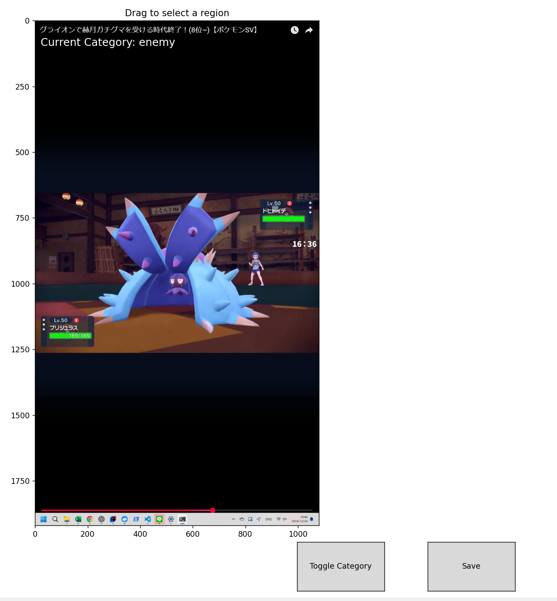

# OCR_POKE

日本語の画像からテキストを抽出するOCRツールです。

## セットアップ手順

### 1. リポジトリのクローン

```bash
git clone https://github.com/ajioka2310/OCR_POKE.git
cd OCR_POKE
```

### 2. 必要なソフトウェアのインストール

- [Docker](https://www.docker.com/get-started)
- [Visual Studio Code (VS Code)](https://code.visualstudio.com/)
- VS Code 拡張機能:
  - [Remote - Containers](https://marketplace.visualstudio.com/items?itemName=ms-vscode-remote.remote-containers)

### 3. 開発環境のセットアップ

1. VS Code でリポジトリを開きます。

2. 左下の「><」アイコン（Remote - Containers）をクリックし、「Reopen in Container」を選択します。

3. DevContainer の初回セットアップが開始されます。必要な Docker イメージのビルドや依存関係のインストールが自動的に行われます。

### 4. `config.ini` の設定

プロジェクトのルートディレクトリに `config.ini` ファイルを作成し、以下の内容を記述してください：

```ini
[Settings]
image_path = /workspaces/OCR_POKE/images/tests/test1.png
```

### 5. OCR の実行
#### 5.1 スクリーンショットの調整

ローカル環境で下記を実行し、スクリーンショットを取りたいモニタを選択

```bash
cd OCR_POKE/utils 
python .\TakeScreenshot_each.py -- debug
```

ローカル環境で下記を実行し、スクリーンショットを一枚とる。
```bash
python .\TakeScreenshot_each.py --single --monitor_num {hoge}
```

#### 5.2 切り抜き場所の選定
utils/set_clip_config.ipynbをローカルで実行し、切り抜きたい領域を指定して保存する。
Toggleボタンで敵・味方どちらの領域を設定するか決めてからSAVEしてね。


#### 5.3 スクリーンショット連続実行
ローカル環境で下記を実行
```bash
python .\TakeScreenshot_each.py --monitor_num {hoge}
```

#### 5.4 OCR
仮想環境でrun_ocr.pyを実行


これらの手順に従ってセットアップと実行を行ってください。問題が発生した場合はお知らせください。

